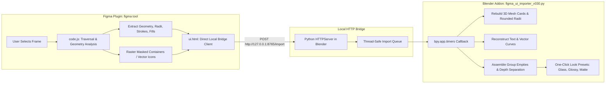

# 🎨 Figment Bridge (Figma to Blender 3D)

> **A high-speed, live bridge and importer that converts 2D Figma UI designs into layered, editable 3D scenes in Blender.**

---

## 🚀 What Is This Tool?

The **Figment Bridge** is a two-part creative workflow tool designed for UI/UX designers, 3D artists, and motion designers. It eliminates the tedious manual reconstruction of 2D UI designs inside 3D software by establishing a direct, real-time bridge between **Figma Desktop/Browser** and **Blender (4.x / 5.0+)**.

With a single click in Figma, any selected frame, component, or screen is analyzed, parsed, and reconstructed in Blender with accurate spatial hierarchy, rounded geometry, typography, and procedural materials.

---

## ⚡ How It Works (Architecture)



---

## ✨ Key Features

### 1. One-Click Instant Bridge (No File Exports Required)
- Runs a lightweight, zero-latency local HTTP server directly inside Blender on port `8765`.
- Pushing a design from Figma streams the complete scene payload instantly into Blender.
- Auto-focuses the Blender window on push so you immediately see your 3D UI update.

### 2. Intelligent Geometry & Card Reconstruction
- **Accurate Corner Radii**: Converts Figma rounded corners into clean, bevelled, and subdivided 3D planar meshes.
- **Hierarchical Grouping**: Reconstructs Figma nested groups into clean Blender Empties parented to a single `FIGMA_<set>_ROOT`.
- **Dynamic 3D Layer Spacing**: An adjustable **Layer Distance** slider lets you explode your 2D design into 3D space with uniform or per-layer depth offsets.

### 3. Multi-Mode Typography Engine
Choose how text enters Blender based on your project's needs:
- **🔤 Native 3D Text**: Fully editable Blender `FONT` curve object that links to your local system fonts.
- **📐 Vector SVG**: Outlined vector curves preserving custom glyph shapes.
- **🖼️ PNG Image**: Pixel-perfect 2D transparent raster on planar cards for 100% font accuracy, drop shadows, and complex ligatures.

### 4. Mask & Container Compositing
- Automatically detects Figma masked layers (e.g. avatar circles, clipped illustrations) and composites them as high-res raster textures with alpha transparency.

### 5. Instant Material Look Presets
Restyle an entire imported screen with a single click in Blender's N-panel:
- **Glossy**: High-specular vibrant aesthetic with sharp highlights (`Roughness: 0.15`).
- **Glass**: Glassmorphism with physical light transmission (`Transmission: 0.80`), subtle refraction, and alpha blending.
- **Matte**: Soft clay diffuse shading (`Roughness: 0.95`) with smooth ambient contact shadows.

### 6. One-Click Studio Lighting (Locked to Main UI Empty)
- Creates exactly 2 pure white Area lights calibrated for 3D UI scenes:
  - **Key Light**: `1000W` (front-right)
  - **Fill Light**: `800W` (front-left)
- Both lights are dynamically locked to the main UI empty (`FIGMA_*_ROOT`) using Blender's **Track To** constraint. Wherever you move the UI or lights in 3D space, the illumination stays perfectly focused on the center of your design.

### 7. Instant Text & Icon Shadow Toggle
- A dedicated toggle in Blender's N-panel to selectively disable ray shadow casting on text, SVG vectors, and icons.
- Background cards, frames, and planar surfaces continue casting shadows onto the scene normally, giving a clean graphic look without messy text drop shadow overlaps.

---

## 📁 Repository Structure

```text
├── figma tool/               # Figma Plugin source code
│   ├── manifest.json         # Figma plugin manifest
│   ├── code.js               # Core parser, geometry engine, and bridge client
│   └── ui.html               # Modern dark-mode Figma plugin UI
│
├── figma_ui_importer_v030.py # Blender Addon (Python)
│                             # Persistent HTTP server, mesh/text builder, depth controls
│
├── website/                  # Showcase & Documentation
│   └── TOOL_OVERVIEW.md      # This comprehensive guide
│
└── dist/                     # Distribution archives ready for install
    ├── figma_to_blender_addon_v1.0.0.zip
    └── figma_plugin_v1.0.0.zip
```

---

## 🛠️ Quick Installation Guide

### Step 1: Install Blender Addon
1. Open Blender (version 4.0 or 5.0+).
2. Go to **Edit > Preferences > Add-ons**.
3. Click the downward arrow / **Install from Disk...** and select `figma_ui_importer_v030.py` (or install the zip).
4. Enable the checkbox for **Figma UI Importer**.
5. The **Figma UI** tab will appear in your 3D Viewport N-Panel with the bridge server running automatically.

### Step 2: Install Figma Plugin
1. Open Figma Desktop.
2. Go to **Plugins > Development > Import plugin from manifest...**.
3. Select `figma tool/manifest.json`.
4. Run the plugin on any frame and click **⚡ Push Selection to Blender**.
